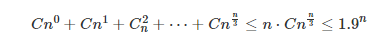
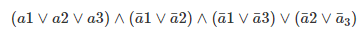
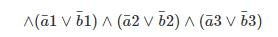
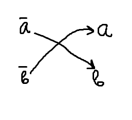

#3-раскраска графа
Задача раскрасить граф из N вершин в 3 цвета, чтобы соседние узлы были разного цвета и количество использований каждого цвета было минимальным.

Степенную сложность степени не убрать никак, на данный момент самый эффективный алгоритм - 
O(1.232^N).

###Алгоритм полного перебора
Самый примитивный метод.

Генерация всех возможных три-раскрасок и проверка каждой на корректность. Сложность такого алгоритма - O(3^N), т.к. это число возможных три-раскрасок графа.
Пусть дан граф и дана его раскраска. Чтобы проверить её корректность, нужно обойти все ребра и проверить, если одинаковые цвета на концах. Значит, сложность проверки - линейная.

  
###Перебор с учетом выбора только из 2 цветов 
То же самое, что в прошлом, но на каждом шаге выбираем из 2 цветов - цвет, в который окрашена предыдущая вершина, точно не подходит.

Так сложность - O(2^N).

###Перебор подмножеств размера <= n/3
Есть два соображения:
* Если граф уже раскрашен, то вершины разделяются на множества по цвету (3 цвета, 3 множества). Очевидно, что внутри этих множеств нет ребер (иначе вершины разного цвета были бы). Если есть n вершин и 3 множества, то одно из этих множеств будет иметь мощность <= n/3.
* Пусть нам заранее известно одно из этих множеств. Тогда все оставшиеся вершины красятся с линейной сложностью O(N).

Как выбрать такое множество. Способов

Это радиус шара Хэмминга.

Тогда сложность - O(1.9^N).

###Вероятностный алгоритм. Сведение к задаче выполнимости
Рассматриваем все цвета для вершин, в которые их можно покрасить - (1, 2, 3). Далее случайным образом выкидываем у каждой вершины 1 цвет. То есть у кого-то будет (1, 2), у кого-то (1, 3), у кого-то (2, 3). Тогда каждая вершина может быть покрашена в один из двух цветов.

Такую задачу можно свести к задаче 3-SAT (не больше 3 букв в выражении). SAT от слова ?satisfability? - выполнимость логических формул. Исходная задача не полиноминальная, а 3-SAT - полиномиальная.

Пусть каждый цвет обозначается а1, а2, а3. Тогда для **одной вершины** надо выбрать один из этих цветов, то есть верно следующее

Тут первая скобка говорит о том, что нужно покрасить вершину в какой-то цвет. Остальные - подходит только один цвет.

Но еще надо учесть ограничение три-раскраски, то есть надо смотреть на цвета инцидентных вершин (пусть они другими буквами аналогично называются - b1, b2, b3 и тд).

Вычеркиваем неиспользуемые цвета. Тогда получаем 2-SAT задачу, где в каждой скобке не больше 2 букв. Это будет полиномиальное время.

Преобразовываем выражения к имплементации.
(a\/b):
* !a -> b
* !b -> a

// -> - это импликация если что//

На основе таких двоек строим граф.

Если в скобке a и !b или !a и b, то невозможно подобрать пару.

Крч, получаем двудольный граф. (Задачу 2SAT возможно свести к графу, и решением будет поиск компонент связности.)
Строим по двудольному графу выполняющий набор. Так находим выполнимость булевой формулы.

Если решение задачи найдено, то граф может быть раскрашен. Но обратное неверно - мы могли на первом этапе вычеркнуть нужные цвета для раскраски.

Вероятность, что раскраска после вычеркивания подойдет - (2/3)^N. Это оооочень мало.
Будем исправлять.

Компенсируем ошибку количеством итераций!!

Если прогоним алгоритм (3/2)^N, вероятность **ошибки** станет 1/e.

Если прогнать **еще 100 раз**, то получится 1/e^100.

Считаем сложность. 

1 итерация линейная, сл весь алгоритм 1.5^N * c. Так вероятность ошибки 1/e^c. Константу не учитываем и получаем.

Сложность - O(1.5^N).

####Применение раскраски на практике
* карта - отображение информации, где между объектами есть границы. Самое простое - раскраска стран на карте. 
* расписание - оптимальное распределение переменных по регистрам.
* Задача планирования. Пусть есть список заказов, которые начинаются и заканчиваются в определенное время. Нужно понять, какое минимальное количество ресурсов нужно выделить для решения этих заказов. Сводится так: пересечение заказов по времени - ребро графа. Хроматическое число графа и есть ответ.
