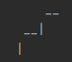
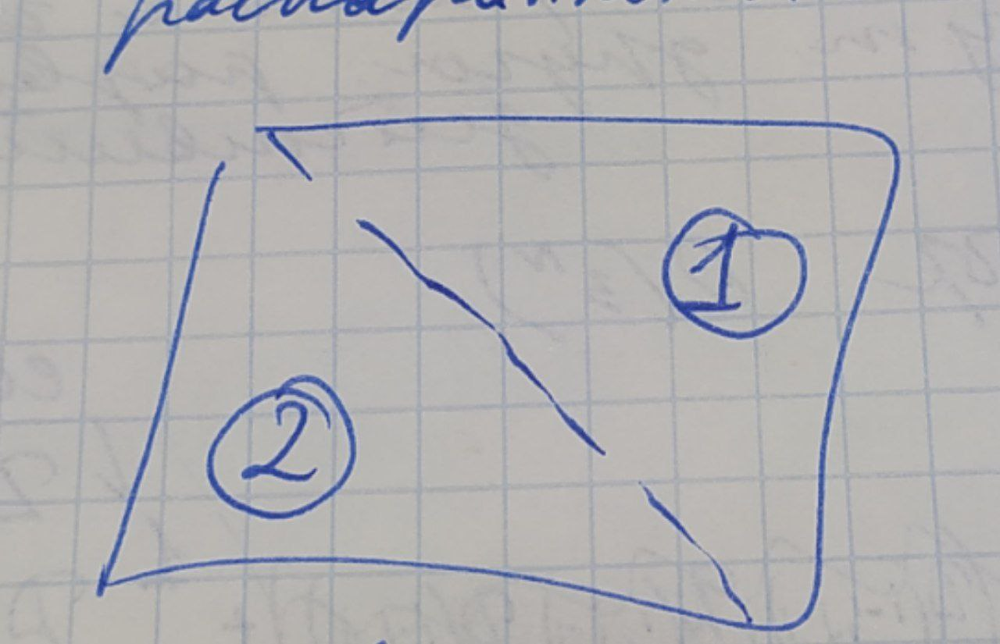
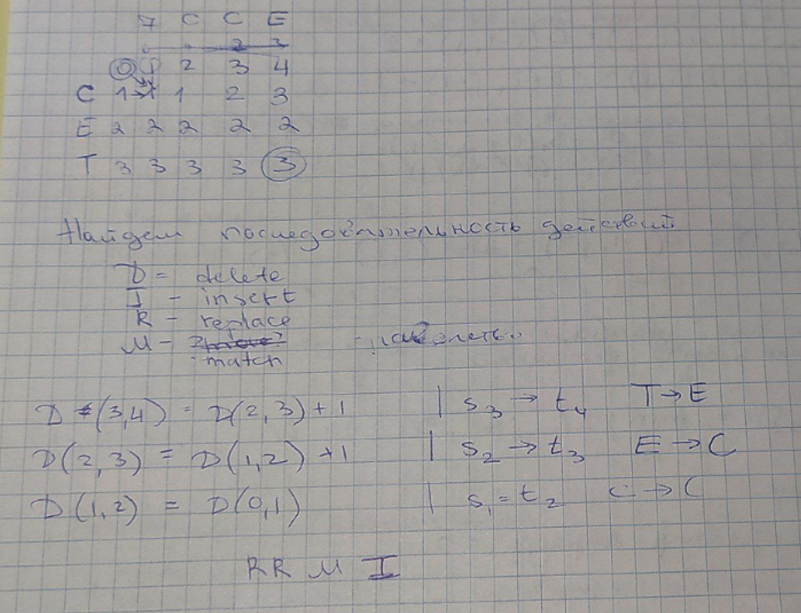

# ДП. Редакционное расстояние
## Динамическое программирование - ДП

Динамическое программирование (DP) - это метод оптимизации, который позволяет решать задачи, разбивая их на более мелкие подзадачи и сохраняя результаты этих подзадач для последующего
использования.

### Примеры вычисления чисел Фибоначчи
#### Можно вычислять рекурсивно

    def fibonacci(n):
        if n == 1 or n == 2:
            return 1
        return fibonacci(n-1) + fibonacci(n-2)

Что по минусам:
* пересчитываем одни и те же числа несколько раз

#### Через массивчик

    def fibonacchi(n):
        fib_arr = [0, 1]
        for i in range(2, n+1):
            fib_arr.append(fib_arr[i-1] + fib_arr[i-2])
        return fib_arr[n]

Тут из минусов память.

#### Супер мега круто. И память, и не рекурсия

    def fibonacci(n):
        prev = 0
        this = 1
        next = 0
        for i in range(2, n+1):
            next = this+prev
            prev = this
            this = next
        return next

Тут линейная сложность кста - O(N).

### Максимальная возрастающая подпоследовательность

Необходимо найти максимальную возрастающую подпоследовательность (она необязательно подряд). Например, для 5 2 8 6 3 6 9 7 это будет 2 3 6 9.

S - последовательность

L(i) - функция, которая возвращает длину максимальной подпоследовательности возрастающей, оканчивающейся на i-й элемент.

То есть для 5 2 8 6 3 6 9 7
* L(0) = 1
* L(1) = 1
* L(2) = 2

Заведем массив для этой функции и будем его обновлять при движении слева направо. i-й клетке соответствует значение L(i).

    S - последовательность
    L = [0]*len(S)
    for i in range(len(S)):
        j = -1
        // ищем максимальный индекс
        for k in range(len(S)):
            if s[i] > s[j]: // если текущий больше, запоминаем индекс
                j = k
        // если не найден индекс, это начало подпоследовательности, сл 1
        if j == -1:
            L[i] = 1
        // если найден, увеличиваем длину подпоследоваетльности
        else:
            L[i] = L[j] + 1

Сложность - O(N^2).

## Редакционное расстояние
### Расстояние Левенштейна (редакционное расстояние)
Редакционное расстояние - минимальное количество символов, которые нужно вставить, удалить или заменить, чтобы получить из одного слова другое.

Применение:
* подсказки
* запросы в интернете
* сравнение путей в графе
* сравнение геномов (мыши и человека), но тут другая развесовка действий

Определены равноценные действия:
* замена символа
* добавление
* удаление

Полный перебор - O(3^N). Три операции доступны на каждом шаге.

### Вычисление редакционного расстояния методом ДП - у нас будет двумерная динамика
s1, s2 - строки. Длины N, M

diff - функция разницы символов

    diff(i, j) = 1, если s1[i] != s2[j]
    
    diff(i, j) = 0, если s1[i] == s2[j]

D(i, j) - функция для редакционного расстояния

    D(0, j) = j
    
    D(i, 0) = i
    
    D(0, 0) = 0
    
    D(i, j) = min( D(i-1, j-1)+diff(i, j) ; D(i-1, j)+1 ; D(i, j-1)+1 )
    
    Это               замена в s1   ;    удаление из s1  ;  вставка в s1

Заполняем из левого верхнего к правому нижнему. Ответ в правой нижней.

**Сложность по памяти - O(N*M).

Сложность - O(N*M)**

Можно оптимизировать:
1. Хранить край матрицы вот такой

2. Можно распараллелить вычисления с помощью заметающей диагонали. Результаты 1 не зависят от 2.

### Восстановление РП по таблице (обратный ход в методе ДП)

Восстановление происходит с конца. Переходим по клеткам, чтобы уменьшалось значение в клетках. 

