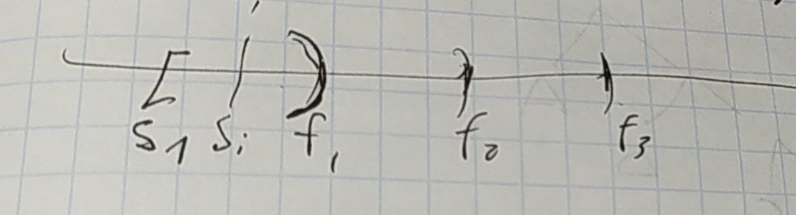
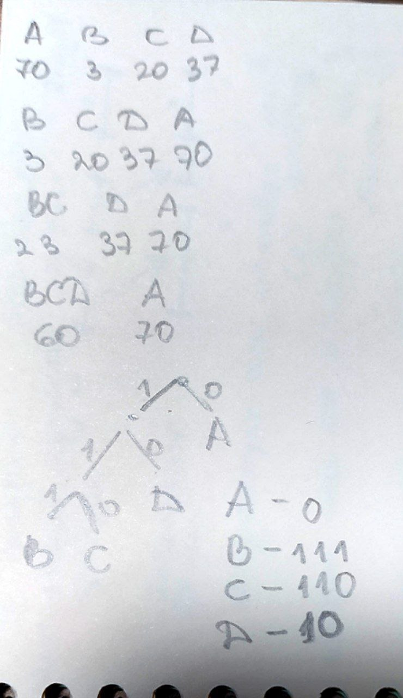

# Жадные алгоритмы
Жадные алгоритмы - это методы решения задач, при которых принимается наилучшее в данный момент решение без учета будущих последствий. Это значит, что алгоритм выбирает оптимальное решение на каждом шаге и не пересматривает свой выбор после того, как он был принят.

Нам обязательно показать, что, откусив кусочек задачи, мы можем по оставшемуся построить оптимальное решение. 

Важно:
* прошлое можем помнить, но откатиться не можем
* о будущем не задумываемся

### Задача об оптимальном расписании
Есть расписание. Это набор временных промежутков. Каждый промежуток имеет определенное начало и конец - то есть в течение дня их двигать нельзя. Они могут друг на друга накладываться.

    [Si, Fi), [Si+1, Fi+1), ...

Fi, Si+1 могут совпадать, а могут и не совпадать. Надо максимизировать количество выполненных задач.

1. Сортировка интервалов по Fi 
2. Добавляем с min Fi в решение
3. Отсекаем те, что уже не попадут (начинаются слишком рано) ?
4. Повторяем

Докажем, что min Fi будет входить в одно из глобальных оптимальных решений.

I. S1 -> другие точно не лучше этого решения.

II. Если есть [Si, Fi), [S1, F1), где Fi=F1, то мы можем взять [Si, Fi) и это не изменит решение, так как не влияет на остальные - не сдвигает их старт.

По идее, сложность O(N^2), где N - количество задач. Без учета сортировки.
### Задача о префиксном кодировании - Хаффман

Пусть есть набор символов и их частота.

    A - 70
    B - 3
    C - 20
    D - 37

1. Сортировка по возрастанию частот
2. Объединяем 2 минимальных. Частоты складываем
3. Повторяем, пока можем, 1-2
4. Начинаем раскручивать в обратную сторону и удлиняем коды

Есть вопросы по этому, но это есть в моем конспекте (сложность n с точностью до структуры данных написано)

Сложность O(n) + сортировка

### Принцип доказательства оптимальности работы жадного алгоритма
Два принципа жадного алгоритма (условия для использования):
* принцип жадного выбора
* оптимальноть для подзадач

Калишенко еще говорил про предобработку данных, но этого нет в презенташке иванова.

Принцип жадного выбора имеет место быть, когда имеем последовательность локально-оптимальных выборов -> получаем глобально-оптимальное решение.

Данная логика работает только при условии, что решаемая задача обладает свойством оптимальности для подзадач, т.е. оптимальное решение всей задачи обязательно содержит в себе оптимальные решения подзадач, из которых она состоит.
