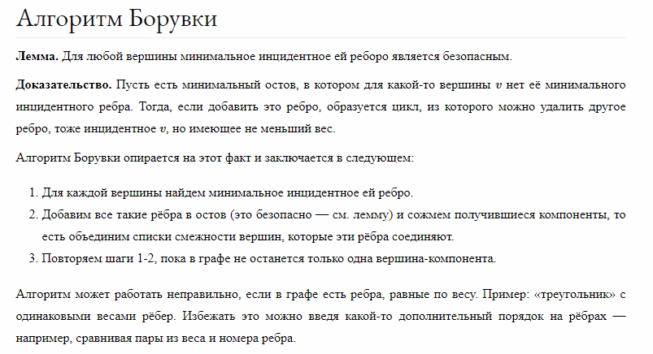
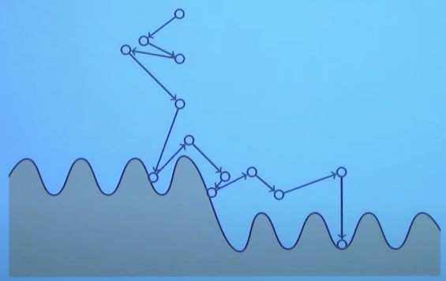
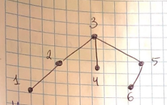

#Задча о коммивояжере
Задача коммивояжера (Traveling Salesman Problem, TSP) является классической задачей оптимизации комбинаторного типа. В ней требуется найти самый короткий путь, проходящий через все
заданные города и возвращающийся в исходный город. (Найти гамильтонов цикл минимальной длины).

Граф не ориентированный, но взвешенный.

###Сложность полного перебора
Полный перебор занимает O(N!) 

Мы перебираем всем перестановки и выбираем лучшую. Количество перестановок N объектов равно N!.

###Ближайший сосед
Каждый раз идем в ближайшего из непосещенных соседей. Но возможна ситуация, когда итоговый найденный путь будет длинее того, что идет не по минимальным ребрам.

Если граф Евклидов (расположен в евклидовом пространстве), т.е. есть оценка не только по ребру, но еще и геометрическая, то можно избежать такую ситуацию.

###Метод ветвей и границ
Общая идея тривиальна: нужно разделить огромное число перебираемых вариантов на классы и получить оценки (снизу – в задаче минимизации, сверху – в задаче максимизации) для этих классов, чтобы иметь возможность отбрасывать варианты не по одному, а целыми классами. Трудность состоит в том, чтобы найти такое разделение на классы (ветви) и такие оценки (границы), чтобы процедура была эффективной.

Есть две эвристики:
* ветви - в каком порядке выбирать еще не посещенные вершины (например, начинать с ближайших)
* границы - нижняя оценка решения

Особенности метода:
* находит оптимальное решение
* время работы зависит и от эвристик, и от входных данных

Суть:
* начнем с какой-нибудь вершины (ищем цикл, сл можем с любой начать)
* на каждой итерации рекурсивно дописываем к текущему пути еще 1 вершину, в которой не были
* когда становится понятно, что расширение пути не приведет к хорошему решению, перестаем попытку расширения

####Отсечка по текущему найденному пути
Если текущий вес гамильтонова пути больше, чем лучший вес (нижняя оценка) - отсекаем ветку решений.

####Отсечка по весу МОД
Вес оптимального цикла коммивояжера не меньше:
* 1/2 * SUM по v (дваи мин. ребра, смежных с v)
* веса минимального покрывающего дерева (при выкидывании ребра из оптимального цикла получается покрывающее дерево)

Поэтому считаем МОД. Если текущее решение + вес МОД > min, скипаем.

Построение МОД занимает O(m * logN) //вроде это алг Борувки//. Итераций не больше O(logN). На каждой итерации можем просматривать почти все ребра, поэтому всего O(m * logN).

###Локальный поиск
Граф всегда полный - нет ограничений как идти.

Это недетерменированный метод.

    S - какое-то начальное решение 
    while в окрестности S есть решение S' большего веса:
        замена S на S'
    s ответ

####2-окружение
В каждом решении пытаемся стереть 2 ребра и заменить на какие-то другие.

####Имитация отжига

Чтобы что-то улучшить, надо что-то иметь. Своими выборами стремимся к локальному min, но это не самый min.
Смысл в том, что мы с некоторой вероятностью ухудшим решение. Так можно перескочить в поначалу худшее решение, но глобально лучшее (дойжу до глобального min).

Это применяется. Оно не обосновано математически, по опыту физики.
В некоторых алгоритмах прыжок происходит в рамках некоторого рассеивания.

    S - какое-то начальное решение
    loop:
        S' - случайное решение из окружения s
        delta = cost(S') - cost(S)
        if delta < 0:
            замена S на S'
        else:
            замена S на S' с P=e^(-delta/T) // T - температура или время, величина, которая постепенно растет

###Приближенное решение (2-приближенный алгоритм)
Алгоритм, который дает решение, которое максимум во сколько-то раз хуже оптимального решения.

Неориентированный граф

**_!!! Необходимо Евклидово пространство для неравенства треугольника !!!_**

1. Построить МОД Т
2. Продублировать каждое _ребро_ дерева Т (чтобы в дереве можно было возвращаться к предыдущей вершине по тому же ребру)
3. В полученном графе найти эйлеров цикл
4. Выкинуть из этого цикла все повторения (пользуемся неравенством треугольника)

Пример (построили такое МОД):

У этого МОД с дублированными ребрами эйлеров путь 1-2-3-4-3-5-6. Дублируется 3. 

Вычеркиваем ее и получаем 1-2-3-4-5-6.

Пространство у нас Евклидово, следовательно, 4-5 <= 4-3 + 3-5. То есть мы по идее улучшили путь.

#####Доказательство этой штучки
Пусть Wt - вес МОД, Wopt - вес оптимального гамильтонова цикла.

Wt <= Wopt, так как при выкидывании ребра из гамильтонова цикла получается остовное дерево.

Каждое ребро построенного гамильтонова цикла заменяет какой-то путь эйлерова цикла, длина которого по неравенству треугольника не менее длины этого ребра.

Получается, длина найденного пути не превосходит 2Wt, а следовательно, и 2Wopt.

###Динамическое программирование
Динамическое программирование (DP) - это метод оптимизации, который позволяет решать задачи, разбивая их на более мелкие подзадачи и сохраняя результаты этих подзадач для последующего
использования.

