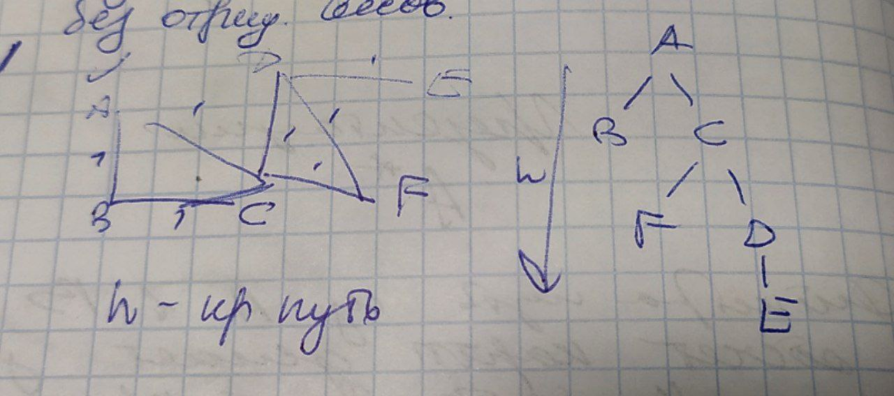

# Кратчайшие пути. А*

## Напоминание об алгоритмах поиска пути:

### Поиск в ширину
BFS (breadth first search) — это алгоритм, используемый для обхода или поиска в графах и деревьях. Он начинается с выбранной вершины и обходит сначала все доступные вершины на текущем уровне перед переходом на следующий уровень.
Алгоритм BFS очень похож на Волновой алгоритм, так как волновой алгоритм относится к семейству алгоритмов основанных на методах поиска в ширину.
Обход в ширину работает на основе очереди.

Как я понимаю, строим с помощью обхода в ширину дерево.

Тут получаем кратчайший путь длины n.

Сложность - сложность обхода в ширину - O(V+E).

### Дейкстра
* без отрицательных весов

Идея алгоритма
1. Каждый раз, когда мы хотим посетить новый узел, мы выберем узел с наименьшим известным расстоянием.
2. Как только мы переместились в узел, мы проверяем каждый из соседних узлов. Мы вычисляем расстояние от соседних узлов до корневых узлов, суммируя стоимость ребер, которые ведут к этому новому узлу.
3. Если расстояние до узла меньше известного расстояния, мы обновим самое короткое расстояние.

На каждом шаге существует множество уже обработанных вершин и еще не обработанных.

    for (v ∈ V)
        DIST[v] = ∞
        PREV[v] = ∅
    DIST[v' ∈  V] = 0  // стартовая вершина
    // Первый шаг:
    H ← MakeQueue() // формирование очереди с приоритетами для вершины v'. Все инцидентные вершины попадают сюда
    while (H ≠ ∅)
        v ← min(H) // из очереди с приоритетами выбирается минимальный DIST[v]
        for (vu ∈  E) //для каждого инцидентного ребра
            if (DIST[u] > DIST[v] + w(v,u) // если расстояние до вершины больше, чем то, по которому мы проходим - условие релаксации
                DIST[u] ← DIST[V] + w(v,u)
                PREV[u] ←
    UpdatePriorities(H)

**_Сложность алгоритма_**

Худший случай - каждый путь содержит в себе все остальные ( v вершин). Если каждый такой путь будет хранится к каждой вершине, память будет 
**v^2**. 

Для оптимизации в каждой вершине хранится не весь путь, а только предыдущую вершину, из которой можно попасть в текущую.

Общая сложность алгоритма:
* O(V^2) - при работе на массиве;
* O(V*ln(V)) - при работе на куче.

Если количество ребер небольшое, выгоднее использовать реализацию на куче, если же ребер намного больше, чем вершин, лучше использовать работу на массиве.

## A*:
Алгоритм поиска A* — относится к эвристическим алгоритмам поиска по первому лучшему
совпадению на графе с положительными весами ребер, который находит маршрут с наименьшей
стоимостью от одной вершины (начальной) к другой (целевой, конечной).

Алгоритм использует вспомогательную функцию (эвристика), чтобы направлять поиск решения и
сокращать его длительность. Алгоритм полный в том смысле, что всегда находит оптимальное решение, если он существует

При выборе вершины учитывается весь путь до нее.
### Выбор направления пути Дейкстрой при 0-взвешивании рёбер оптимального пути

Есть функция потенциала вершины phi(v):

    phi(v) = g(v) + h(v)
    g(v) - расстояние от старта до вершины. Оно известно точно.
    h(v) - расстояние от вершины до финиша. ЭВРИСТИКА.

Если по этой функции перевзвесить граф, то алгоритм Дейкстры даст кратчайший путь (тот же самый).

По сути схема работы такая:

    FUNCTION A*(start,end)
        closedset = the empty set // Множество вершин, которые уже были обработаны(раскрыты)
        openset = {start} // Множество вершин(очередь), которые предстоит обработать(раскрыть).
                          // Изначально здесь присутствует только начальная вершина start.
        fromset = the empty set // Карта пройденных вершин. Используется функцией RECONSTRUCT_PATH
                                для восстановления пути (вывода результата).
        
        // Заполняем свойства вершины start
        G(start) = COST(start,start) = 0 // Стоимость пути от начальной вершины. У start g(x) = 0.
        F(start) = G(start) + H(start,end) // h(x) - эвристическая оценка расстояния до цели.
        
        // Основной цикл алгоритма
        WHILE openset IS NOT EMPTY
            curr = MIN_F(openset) // Вершина из openset имеющая самую низкую оценку f(x).
            IF (curr = end) RETURN RECONSTRUCT_PATH(fromset,start,end) // Выводим результат.
            REMOVE curr FROM openset // Вершина curr пошла на обработку, а значит её следует удалить из очереди на обработку.
            ADD curr TO closedset // И добавить в список уже обработанных.
            
            FOREACH neighbour OF curr neighbours // Проверяем каждого соседа curr
                IF neighbour IN closedset CONTINUE // Пропускаем соседей из закрытого списка (предварительный, ожидаемый)
                    tentative_g_score = G(curr) + COST(curr,neighbour) // Вычисляем g(x) для обрабатываемого соседа
                IF neighbour NOT IN openset // Если сосед curr ещё не в открытом списке
                    ADD neighbour TO openset //добавим его туда
                    tentative_is_better = TRUE // вводим признак того, что нужно обновить свойства для соседней вершины
                ELSE	// Сосед был в открытом списке, а значит мы уже знаем его g(x), h(x) и f(x)
                    IF tentative_g_score < G(neighbour) // Вычисленная g(x) оказалась меньше, а значит нужно будет обновить значения g(x), h(x), f(x)
                        tentative_is_better = TRUE
                    ELSE // Вычисленная g(x) оказалась больше, чем имеющаяся в openset.
                         // Это означает, что из вершины curr путь через этого соседа дороже
                         // т.е. существует менее дорогой маршрут, пролегающий через этого соседа (из какой-то другой вершины, не из curr)
                         // Поэтому данного соседа мы игнорируем
                         tentative_is_better = FALSE
                     // Обновление свойств соседа.
                     IF tentative_is_better = TRUE
                        fromset(neighbour) = curr //Вершина с которой мы пришли. Используется для реконструкции пути.
                        G(neighbour) = tentative_g_score
                        F(neighbour) = G(neighbour) + H(neighbour, end)
                    // Обратите внимание, что если происходит обновление свойств - значит neighbour(сосед curr) так или иначе находится в openset.
                    // Т.е. при следующей итерации внешнего цикла из openset будет извлечена вершина с наименьшей оценкой f(x).
                    // Не исключено, что она окажется соседом нашего curr, которого мы только что добавили.
                    // В общем это самая важная особенность алгоритма А*.
    RETURN FAILURE // управление передаётся сюда когда openset пуст,а вершина end не найдена (путь найти не удалось)
    
    // Восстанавливаем результироующий путь.
    // Путь можно проследить только от заданной вершины(чаще всего это end) к старту(каждая вершина имеет пути находится в fromset, чем мы и воспользуемся).
    
    FUNCTION RECONSTRUCT_PATH(fromset,start,end)
        pathset = the empty list // Упорядоченное множество результирующих вершин пути.
        curr = end // Поиск начинается от финиша.
        ADD curr TO pathset // Добавляем end в результирующий путь.
        
        WHILE curr <> start // Добавляем в путь все вершины от end до start.
            curr = fromset(curr) // Получаем вершину из которой пришли в curr.
            ADD curr TO pathset // Добавить вершину в результирующий путь.
    RETURN REVERSE(pathset) // Так как мы построили путь от end к start, то результирующий набор вершин необходимо перевернуть.

### Сложность:
Обычно алгоритм A* просматривает только часть вершин. Однако, в лабиринтах быстродействие приближается к худшему случае. Быстродействие алгоритма существенно зависит от двух факторов:
* Точность эвристической функции.
* Реализация контейнеров известных и исследованных вершин: наиболее затратными операциями в алгоритме есть операции сложения, изъятия и изменения элементов в списках известных и исследованных вершин. По их быстродействие существенно влияют конкретные реализации этих структур данных.

Пусть имеется множество вершин в графе, информация о вершинах и ребрах доступна до начала работы алгоритма, использованная эвристическая функция — монотонная. Список известных вершин реализован как бинарная куча, список исследованных — как массив. Тогда алгоритм A* имеет квадратичную зависимость от количества вершин графа и худшее время работы:
**O ( |V|^2 )**

Функция MIN_F(openset) может быть оптимизирована. Если каждая вершина хранится как указатель на соответствующий объект в куче, то время работы функции уменьшится с квадратичного до логарифмического, а общее время работы алгоритма — до линейно-логарифмического:
**O ( |V| * log|V| )**

### Доказательство неизменности пути при перевзвешивании рёбер

    В перевзвешенном графе
    
    s - начало
    t - конец, цель
    l' - оценка по ребрам
    l'(v, w) = l(v, w) - f(v) + f(w)
    
    Пусть p - путь какой-то
    l'(p) = l'(s, v1) + l'(v1, v2) + ... = l(s, v1) - f(s) + f(v1) + l(v1, v2) - f(v1) + f(v2) + ... + l(vk, t) - f(vk) + f(t) = l(p) - f(s) + f(t)
    
    Т.е. путь остается тем же самым кратчайшим путем.

### Ограничения А*
Не должно быть ребер с отрицательным весом!

## Эвристические функции
h(v) - эвристическая функция. Оценка расстояния от вершины до финиша. 

Если h() тождественно равна 0, то алгоритм станет буквально Дейкстрой.

Для вершин на кратчайшем пути справедливо:
* f(v1) - f(v2) = l(v1, v2)

Говорят, что эвристическая оценка h(v) **допустима**, если для любой вершины v значение h(v) <= dist(v, t). 

То есть нет переоценки вершины! Возможна лишь недооценка. 

Допустимая оценка является оптимистичной, потому что она предполагает, что стоимость решения меньше, чем оно есть на самом деле. Второе, более сильное условие — функция h(v) должна
быть **монотонной** (т.е для любой вершины v1 и ее потомка v2 разность h(v1) и h(v2) не превышает
фактического веса ребра l(v1, v2) от v1 и v2, а эвристическая оценка целевого состояния равна нулю).

h() зависит от задачи. Она выбирается для конкретного случая.

А* не всегда дает оптимальное решение, но если мы работаем в Евклидовом пространстве и h() монотонна и подчиняется неравенству треугольника, то всегда будет получено оптимальное решение.

### Примеры эвристик

1. Если можно в четырех направлениях перемещаться, то лучше брать манхэттенское расстояние

    h(v) = |v.x - t.x| + |v.y - t.y|

2. Если четыре направления + диагонали, то расстояние Чебышева

    h(v) = max( |v.x - t.x)| , |v.y - t.y| )

3. Если передвижение не ограничено сеткой, то можно брать евклидово расстояние по прямой

    h(v) = sqrt( (v.x - t.x)^2 + (v.y -t.y)^2 )

