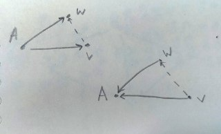

# Кратчайшие пути. Эвристики ГИС

### Алгоритм ALT
ALT = A* + Landmarks + Triangle inequality

Алгоритм ATL (A* + Landmarks + Triangle inequality) - это комбинированный алгоритм поиска кратчайшего пути, который объединяет идеи из трех различных подходов: алгоритма A* (A-star),
использования ориентиров (landmarks) и неравенства треугольника.
Ориентиры − это ключевые вершины графа, выбранные для вычисления приближенных расстояний до остальных вершин.

Это модификация эвристики А*!

В этом алгоритме мы уменьшаем время запроса засчет увеличения времени препроцессинга.
То есть алгоритм состоит из препроцессинга и запросов.

Препроцессинг:
1. Подготовка данных. Определение меток.
2. Вычисление расстояний до ориентиров. С помощью Дейкстры считаем расстояния от каждой вершины до каждой метки.
3. Вычисление нижних оценок. Как раз модифицированная эвристика.

    dist(v, w) >= dist(A, w) - dist(A, v)

    dist(v, w) >= dist(v, A) - dist(w, A)

    dist(v, w) >= max( dist(A, w) - dist(A, v) ; dist(v, A) - dist(w, A))

    Мы знаем, что h(v) <= dist(v, t). ?? Получается, нам подходит такая эвристика h(v) = max( dist(A, t) - dist(A, v) ; dist(v, A) - dist(t, A)). Если маяков много, по идее можно фигачить максимум из них всех.

    

Запросы:
* Запускаем А*

Алгоритм ATL пытается улучшить производительность алгоритма A* путем использования ориентиров и неравенства треугольника для получения более точных и оптимистичных оценок расстояний. Это позволяет ускорить поиск пути, особенно в больших графах или в случаях с длинными
путями.

Расставлять метки - самое сложное. Потому что от них зависит эффективность. Самый простой, но не эффективный, это делить на секторы постранство и выбирать на краешки (крч просто равномерно по краям распределить). Можно еще как-то через эвристики тоже.

ALT выигрывает в запросе на порядок где-то у А*.

### Алгоритм REACH (RE) 
Это НЕ А*!!

Алгоритм Reach (или Reachability Algorithm) - это алгоритм, используемый для определения
достижимости между вершинами в ориентированном графе. Его основная цель - определить, можно
ли достичь одну вершину из другой по заданному направлению ребер.

Есть функция взвешивания вершин - метрика достижимости:
* r(v, P) = min( dist(s, v) ; dist(v, t) ) - достижимость v относительно P// P - кратчайший путь P между s и t
* r(v) = max по P ( r(v,P) ) - достижимость относительно всего графа

Приоритет отдается вершинам, через которые проходит больше кратчайших путей.

Суть
1. Начальные значения. Все вершины недостижимы
2. Выбор начальной вершины или группы вершин, для которых ищем достижимость
3. Обход с нач. вершин BFS или DFS. Просмотренные помечаем
4. Проверка, достижимы ли целевые вершины из старта.
5. Завершение после проверки целевых вершин и обновления меток.

// Тут дальше от чата гпт

Алгоритм REACH (RE) — это алгоритм для поиска путей в графе, который используется для определения достижимости между вершинами. Он работает путем итеративного поиска и обхода графа, начиная с начальной вершины и проверяя соседние вершины на возможность достижимости.

Алгоритм REACH начинает с начальной вершины и исследует все соседние вершины, добавляя их в очередь для дальнейшего исследования. При этом он отмечает вершины, которые уже были исследованы, чтобы избежать зацикливания на одних и тех же вершинах.

Основная идея алгоритма REACH заключается в том, чтобы пошагово наращивать множество достижимых вершин, пока не будет достигнута конечная вершина или пока не будут исследованы все возможные пути.

Алгоритм REACH эффективен для поиска путей в графе в условиях, когда известна начальная и конечная вершина, и требуется определить, существует ли между ними путь. Он может быть применен, например, для определения возможности достижения от одной точки к другой в сетях связности, транспортных системах, социальных сетях и других задачах, где требуется анализ графов.

// конец гпт

### Оптимизация слияния рёбер (как я понимаю это тоже про REACH)
Если где-то в графе есть длинные цепочки, которые никуда не разветвляются, можно объединить их. Это будет типа shortcut.  

