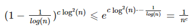

#Минимальный разрез графа
Разрез графа - сколько надо минимально удалить ребер, чтобы граф стал несвязным.

###Примеры практических задач
* расчет надежности и меры устойчивости (обрыв на линии - нужен ли +1 кабель, чтобы повысить устойчивость)
* кластеризация
* при масштабировании карт появляется больше деталей. Так можно определять, какие объекты важнее.

###Алгоритм Каргера
Пока не остается две вершины (между ними последнее мультиребро), удаляем какое-то ребро и стягиваем граф (по сути объединяем вершины, которые соединяла вершина). По сути N-2 шага. Все, что остается между финальными вершинами - разрез.

Повторяем это несколько раз и берем с минимальным количеством удалений ребер.
Так мы получаем эмперическое решение - это какое-то решение. 

Посчитаем вероятность того, что алгоритм вычисляет минимальный разрез. 
* N - количество вершин
* E - множество ребер
* с (cut) - минимальный разрез (множество удаленных ребер)
* k = |c| => степень каждой вершины >=k

Из степени >=k следует, что суммарная степень вершин >= Nk, сл. |E| >= k*N/2.
P(получен минимальный разрез) = P(ни одно удаленное ребро не в разрезе)
P(удаленное ребро в разрезе) = |c|/|E|=k/|E| <= k/(kN/2) =2/N

P(удаленное ребро в разрезе) <= 2/N

P(удаленное ребро НЕ в разрезе) = 1 - P(удаленное ребро в разрезе) >= 1 - 2/N = (N-2)/N

P(все хорошо на всех шагах) = П от 1 до N-2 (P(i-е уд. ребро не в разрезе)) = (N-2)/N * (N-3)/N * ... = 2/(N(N-1)) ~ 2/N^2

Чтобы получить вероятность ошибки 1/e, надо прокрутить алгоритм N^2 раз.

Общая сложность:
* На каждом шаге стягивание N ребер
* За 1 проход N*N стягиваний
* Алгоритм прогоняется N^2 раз

Итого - O(N^4).

Это сильно лучшего полного перебора, но все равно многовато. И мы про минимальность утверждать не можем!!!

###Оптимизация Штейна алгоритма Каргера

1. Оптимизация заключается в том, что сначала стягиваем по обычному методу, пока не останется N/sqrt(2) вершин. На этих шагах P(удалить ребро НЕ из разреза) >= 1/2. 

2. Дважды запускаем такой же алгоритм по оставшемуся графу. Выбираем минимальный результат.

Такая модификация выдает верный результат с вероятностью - P(успех) >= 1/log(N).

Сложность по операциям **итеративная** T(N) = N^2+ 2T(N/sqrt(2)) = N^2 * log(N).

Это медленнее, чем оригинальный алгоритм, однако вероятность нахождения разреза минимального веса экспоненциально выше. Достаточно запустить алгоритм c*log2(n)
 раз, где c - некоторая константа. Действительно, рассчитаем вероятность неправильного ответа также, как раньше

Итоговое время работы - O(N^2 * log(N)) * c * log^2(N) = O(N^2 * log^3(N)).
