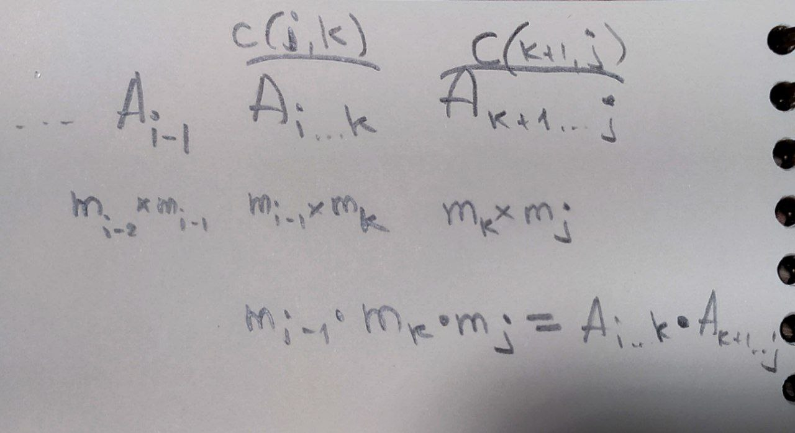

# Перемножение матриц. Константы.

### Задача о порядке перемножения матриц
Это задача актуальная. Матричные перемножения встречаются, например, в машинном обучении.

Рассмотрим пример перемножения матриц A1, A2, ..., An. 

**_Перемножение матриц размером MxN, NxP дает MxNxP операций._**

Пусть A1 - 2x50, A2 - 50x2, A3 - 2x50. 

Посчитаем количество операций при разном порядке выполнения:
* (A1 * A2) * A3 = 2 * 50 * 2 + 2 * 2 * 50 = 400
* A1 * (A2 * A3) = 50 * 2 * 50 + 2 * 50 * 50 = 10000

Разница ощутимая. Есть проблема.

Если использовать рекурсивный алгоритм ( ABCD = A(BCD) = ... , но ABCD = (ABC)(D)), возникнет проблема дублирования (как в фибоначчи), потому что будет в разных ветках какое-нибудь BD. Это дублирование значимо. Его можно убирать с помощью метода динамического программирования. Используем оптимальный перебор, чтобы сократить, практически убрать дублирование.

Перейдем к решению задачи. Все еще A1, A2, ..., An. M1, M2, ..., Mn - размеры, количество столбцов??? (судя по формуле, но в конспектах других строки).
c(i, j) - min число операций для Ai ... Aj матриц (от i матрицы до j). То есть c(1, n) - для перемножения всех матриц.

c(i, j) = 0, i=j

c(i, j) = min по i<=k<j ( c(i, k) + c(k + 1, j) + Mi-1 * Mk * Mj ), i<j

В этой формуле 
* c(i, k) + c(k+1, j) уже перемноженные на предыдущих шагах матрицы Ai..k, Ak+1..j
* Mi-1 * Mk * Mj - сколько операций надо для перемножения Ai..k, Ak+1..j.  

    m - массив размеров
    c() - матрица для значений c. Это не рекурсивная, а рекурентная функция
    for i in range(1, n+1):
        c(i, i) = 0

    for s in range(1, n): // размер подзадачи
        for i in range(1, n-s+1):
            j=i+s
            m = inf
            for k in range(i, j):
                m = min(m, c(i, k) + c(k+1, j) + m[i-1]*m[k]*m[j]
            c(i, j) = m

Сложность - сложность заполнения матрицы, но еще поиск в скрытом цикле - O(N^3).

### Константная сложность на примере vector и unordered_set:

#### Амортизированная
**Амортизированная сложность** - это общие затраты на операцию, оцениваемые по последовательности операций.

Идея состоит в том, чтобы гарантировать общие затраты на всю последовательность, позволяя при этом отдельным операциям быть намного дороже амортизированной стоимости.

**std::vector<>:**

В vectore если есть место за O(1) происходит добавление в конец, но иногда место заканчивается. В этом случае надо сделать реаллокацию - мы выделяем в два раза больше места и перезаписываем туда все, а это O(N).

За N операций будет log2(N) реаллокаций. i-я (считаем с 0) реаллокация будет занимать O(2^i) перемещений. То есть всего перемещений 
1+2+4+...+2^log2(N) = N-1 (прогрессия геом).

N операций выполнилось за O(N). Следовательно, амортизированная константа = O(N)/N = O(1).

Амортизированная константа означает, что мы выполняем N операций за O(N).

**_Другое объяснение (со stack overflow):_**

Поведение C ++ std::vector<>. Когда push_back() размер вектора увеличивается выше его предварительно выделенного значения, это удваивает выделенную длину.

Таким образом, выполнение одного из них push_back() может занять O(N) некоторое время (поскольку содержимое массива копируется в новое выделение памяти).

Однако, поскольку размер выделения был удвоен, выполнение каждого следующего N-1 вызова push_back() будет занимать O(1) время. Таким образом, общее количество N операций все равно займет O(N) время; тем самым давая push_back() амортизированную стоимость O(1) за операцию.

* Так же, как и в случае с неамортизированной сложностью, обозначение big-O, используемое для амортизированной сложности, игнорирует как фиксированные начальные накладные расходы, так и постоянные коэффициенты производительности. Итак, с целью оценки амортизированной производительности big-O, вы обычно можете предположить, что любая последовательность амортизированных операций будет "достаточно длинной", чтобы компенсировать фиксированные затраты на запуск. В частности, для std::vector<> примера, вот почему вам не нужно беспокоиться о том, столкнетесь ли вы на самом деле с N дополнительными операциями: асимптотический характер анализа уже предполагает, что вы столкнетесь.

* Помимо произвольной длины, амортизированный анализ не делает предположений о последовательности операций, стоимость которых вы измеряете - это гарантия наихудшего варианта для любой возможной последовательности операций. Независимо от того, насколько неудачно выбраны операции (скажем, злоумышленником!), амортизированный анализ должен гарантировать, что достаточно длинная последовательность операций не может стоить последовательно больше суммы их амортизированных затрат. Вот почему (если специально не указано в качестве определителя) "вероятность" и "средний случай" не имеют отношения к амортизированному анализу - не больше, чем к обычному анализу big-O в наихудшем случае!

#### В среднем + в худшем
**std::unordered_set:**

find - O(1) - _в среднем_. У нас за O(1) только 1 элементы в массиве цепочек при коллизии хранятся. А вообще-то это длина цепочки O(max_load_factor)

load_factor = N/b - средняя длина цепочки, N элементов всего, b бакетов (по этому числу % берем у хэшфункции)

средняя длина цепочки <= max_load_factor - это поддерживается структурой данных. 

Если задали max_load_factor = 1, то O(1). Поэтому время поиска не зависит от числа элементов в структуре данных.

Средняя константа отличается от амортизированной. В амортизированной мы точно гарантировали, что N операций выполнится за O(N) реаллокаций и в общем будет амортизированная константа O(1). Здесь именно средняя сложность будет O(1). Для оценки среднего есть худший и лучший (в начале и в конце цепочки). Средняя константа не является жесткой гарантией, как амортизированная.
У средней есть худший и лучший случай

как я понял когда ты говоришь про сложность в среднем, то нужно еще и уточнить про сложность в худшем. В unordered_set ты говоришь, что о(1) - в лучшем, а о(n) - в худшем.

