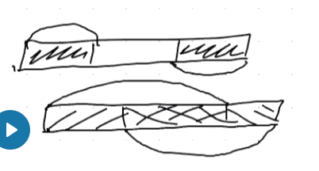
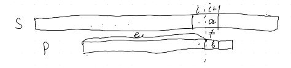
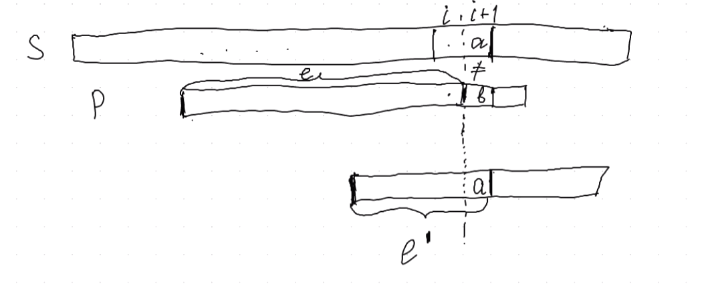
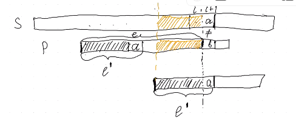
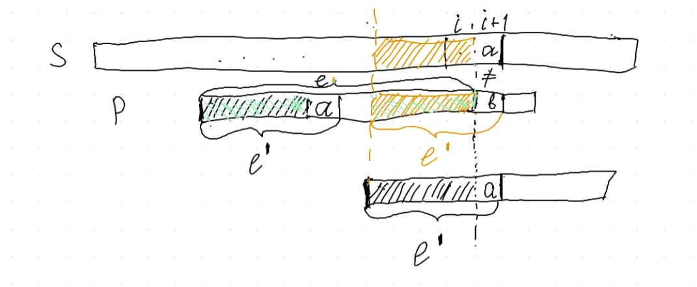
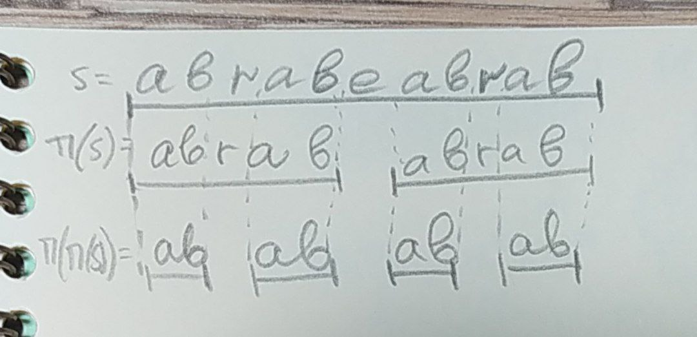
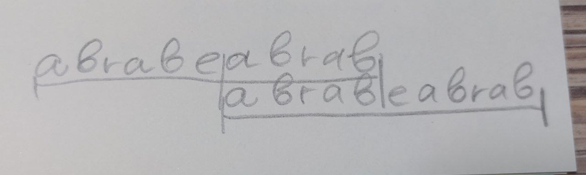
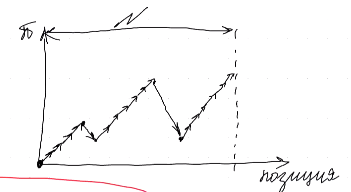
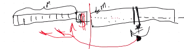

# Поиск подстроки в строке. КМП

## Основные определения
Префикс функция - длина наибольшего префикса (начало) строки, которая не совпадает с этой строкой и одновременно является ее суффиксом (концом).

    S  =  abacaba
    pi(S)= 0010123 - массив со значениями функции для элементов

Можно еще определять не как длину префикса, а как сам префикс такой. Тогда

    S = abacaba
    pi(S) = aba - подстрока

Префикс и суффикс могут перекрываться.

## Задача точного поиска образца в строке
Есть 
* текст T[1...n]
* паттерн P[1...m]
* m<=n

### Наивный алгоритм и его сложность
Мы прикладываем паттерн к тексту. Их будет n-m+1.

    T = aaabcd
    P = abc

Сложность алгоритма - O( (n-m+1) * m ). По сути O( n*m ).

### Алгоритм КМП
Массив значений префикс функции подстрок.

    pi - массив
    pi[i] = значение префикс функции подстроки s[1..i]

Если есть такой массив. Можем сконкатенировать паттерн и текст, поставив между ними не встречающийся символ - разделитель.

    T = abraca
    P = bra
    TP = bra?abraca
    pi[3] = 3 //кажется, правильно

Если в этом массиве есть число, равное по значению m (длине паттерна), то был найден шаблон (была найдена подстрока размера m, равная суффиксу-шаблону). Точно максимально возможный префикс не превосходит по длине m - это гарантирует знак-разделитель между текстом и паттерном.

#### Наивное построение префикс-функции и его сложность

    T - текст
    P - паттерн
    s = P + '&' + T
    for i in range(1, n+1): // N
        for k in range(i, n+1): // N
            if s[0..k] == s[i-k..i]: // линия
                pi[i] = k

Сложность - O(N^3). 

#### Построение префикс-функции за линейное время
Ситуация - хорошо приложили l символов (индексация по шаблону), а l+1 не совпадает.

Двигаем шаблон вправо, чтобы совпало до i+1 элемента (индексация по тексту). Совпадает l' элементов.

Получается, есть префикс в паттерне, который совпадает с суффиксом подстроки l + символ. Длина префикса l'.

Получается, есть подстрока длиной l', которая совпадает. Зеленое - префикс суффикс шаблона, который по сути является префикс функцией от подстроки длины l шаблона.

Чуть более формально:
* хотим найти максимальный l', чтобы P[1..l']=суфф s[1..i+1]
* P[1..l']=суфф s[1..l+1]

Получается:
* P[1..l'-1]=префикс функция P[1..l]
* P[l']=S[i+1]

Лемма:
* {множество префикс суффиксов s}={pi(s), pi(pi(s)), ... , ''}

* Все префикс функции префикс функции префикс функции формируют префикс исходной строки.

Это было перечисление всех префикс суффиксов.

    ind   123456789
    s =   abababcab
    PFL = 001234012 // prefix funcion lenght

Смотрим, можно ли расширить значение предыдущего шага

    pi(s[1..6])=s[1..4]=abab
    pi([1..4])=s[1..2]=ab

Псевдокод

    PFL[1] = 0
    for i in range(2, m+1):
        k=PFL[i-1] // смотрим значение на предыдущем шаге
        if p[k]==p[i]: // если можем расширить, круто. расширяем
            PFL[i]=k+1
        else: // если не можем расширить, откатываемся дальше и проверяем
            while p[k+1] != p[i] and k>=0:
                k=PFL[k]
            if p[i]==p[k+1]: // если нашли, круто. расширяем
                PFL[i]=k+1
            else: // не нашли все равно. 0
                PFL[i]=0

Префикс функция либо возрастает на 1, либо в цикле уменьшается. Она растет не больше N раз. Падать она тоже будет не больше N-1 раз (надо хоть раз подняться). Сложность построения поэтому - O(N) - линейная.

Тогда для всего алгоритма сложность - O(m+n). (мы склеили строки).

#### Оптимизация сложности по памяти

1. Если мы в области после разделителя, то всегда будем откатываться в зону до спец.символа. То есть нам не нужно хранить значения для всех элементов после разделителя - достаточно последней рассчитанной префикс функции (она ведет в нужную область). Память тогда - O(m).

