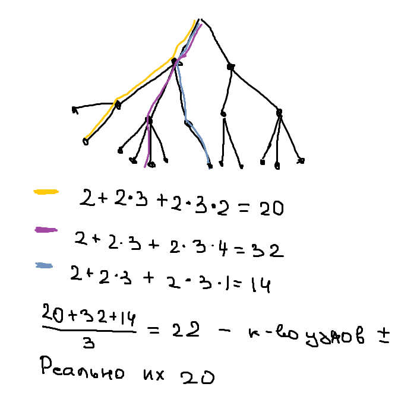
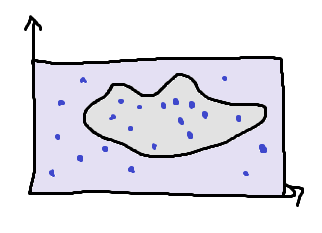

#Поиск с возвратом (backtracing)
Бектрекинг - это универсальный, но очень затратный метод. Время нахождения решения может быть очень большим даже при небольших входных данных.

Это общий метод нахождения решений задачи, в которой требуется полный перебор всех возможных вариантов в некотором множестве М.

Решение задачи методом поиска с возвратом сводится к последовательному расширению частичного решения. Если на очередном шаге такое расширение провести не удается, то возвращаются к более короткому частичному решению и продолжают поиск дальше. Данный алгоритм позволяет найти все решения поставленной задачи, если они существуют. Для ускорения метода стараются вычисления организовать таким образом, чтобы как можно раньше выявлять заведомо неподходящие варианты. Зачастую это позволяет значительно уменьшить время нахождения решения.
####Пример задачи - расстановка 8 ферзей на шахматной доске
 Есть доска размера NxN и 8 ферзей.
 
Сперва на доску ставят одного ферзя, а потом пытаются поставить каждого следующего ферзя так, чтобы его не били уже установленные ферзи. Если на очередном шаге такую установку сделать нельзя — возвращаются на шаг назад и пытаются поставить ранее установленного ферзя на другое место.
Количество комбинаций = 64^8. Но можно до O(N!) уменьшить, так как нельзя на ту же строку и столбец ставить нового ферзя.
Сложность - O(N^2 * N^2 * ...) //тут N множителей// = O(N^N) 

    while (не все решения)
        while (множество позиций не пусто)
            что-то делаем...
 
На данный момент посчитано до N=27

####Подходы метода ветвей и границ по отсеканию вариантов
Метод ветвей и границ - по сути бектрекинг. В его основе последовательное разбиение множества допустимых решений на подмножества (разделяй и властвуй).
1. Можно отсекать ветки решений, если они уже хуже какого-то найденного решения.
2. Можно убирать повторы (в разном порядке получаем одну картину)
3. Симметрия
4. Можно убирать решения с поворотом

Алгоритм:
1. Создание начальной вершины дерева поиска
2. Определение границы для текущей вершины. Верхняя граница - наилучшая известная оценка оптимального решения.
3. Если нижняя граница для текущей вершины > верхней, то отметается она и ее потомки. Они уже не оптимальные.
4. Если текущая вершина - лист, то она решение. Смотрим, лучше ли она. Если лучше, то она новое оптимальное решение.
5. Если НЕ лист, генерим потомков (варианты решения на следующем шаге).
6. Для потомков считаем нижнюю границу. 
7. Рекурсивно выполняем шаги 1-6 для потомков.
8. Ответ - финальное оптимальное решение.

#Метод Монте-Карло
Это численный метод решения математических задач при помощи моделирования случайных величин.
Если совсем примитивно, то работает так:
* Вместо того чтобы строить сложную математическую модель, мы берём простую формулу и пуляем в неё случайные числа. Считаем результат по каждому числу и получаем результат с нужной нам точностью. Чем больше случайных чисел — тем точнее результат.

Методы Монте-Карло в основном используются в трех различных классах задач: оптимизации, численном интегрировании и генерации результатов на основе распределения вероятностей.

Идея - решение задач, использование и подбор такой случайной величины, которая могла бы показать при расчете мат.ожидания результат задачи.

Плюс этого метода в том, что нам не нужно запрягать весь математический аппарат для решения задачи — достаточно подставлять числа в формулу и смотреть, получилось верное значение или нет.

Особенности:
* простая структура вычислительного алгоритма
* ошибка вычисления ~ sqrt(Dx/N), где Dx - постоянная, а N - число испытаний

**_!!!Метод эффективен, где результат нужен с небольшой точностью!!!_**

####Пример на размере дерева - по сути ищем количество узлов

Мы 3 раза по одной ветке случайной прошли. По этой ветке предположили, что все остальные такие же -> можем посчитать количество узлов.
Это будет буквально случайная величина. По этим величинам находим среднее (мат ожидание вроде будет) - и типа это ответ.

####Пример на площади фигуры

Мы генерируем случайные величины - в нашем случае точки. Что-то попало в фигуру, а что-то нет.
* 10 не попали
* 12 попали -> 12/22

Получается, знаем распределение случайной величины. Тогда мат.ожидание

E(x) = 1/k * SUMM по i от 1 до k (x_i)
12/22 * Sкв - ответ

####Ограничения и условия применимости
Ограничения?????:
1. Необходимо большое количество случайных выборок для достижения точных результатов. Это требует значительных вычислительных ресурсов и времени.
2. Метод Монте-Карло может давать только приближенные ответы, а не точные значения, особенно при работе с сложными моделями.
3. Существуют задачи, для которых метод Монте-Карло неэффективен из-за сложных функций распределения или большого числа переменных.
4. Не все задачи можно решить методом Монте-Карло, так как его эффективность зависит от типа задачи и метода моделирования.
5. Для некоторых задач метод Монте-Карло может быть непрактичным из-за ограниченных ресурсов или вычислительной сложности.

 
Условия применимости????:
1. Когда необходимо решить сложную математическую задачу или интеграл, для которых нет аналитического решения.
2. Когда искомая величина может быть представлена в виде статистического среднего.
3. Когда необходимо оценить вероятность события, которое не может быть вычислено аналитически.
4. Когда задача имеет высокую степень ненелинейности и сложные взаимосвязи между переменными.
5. Когда существует возможность проведения большого числа случайных экспериментов.
6. Когда возможно оценить точность результата метода Монте-Карло.

Из найденного конспекта:
* Ex = 1/k * SUMM по i от 1 до k (x_i)
* P(сгенерировали достаточно) = P(| P^N/N - | <= k*b/sqrt(N) )  - вот на столько можем быть уверены в ответе    //при k = 3 равна примерно 0.9973
* Для метода нужно знать функцию распределения и пределы для генерации (в примере с площадью это прямоугольник)
* Распределение не обязательно равномерно 
