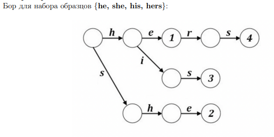
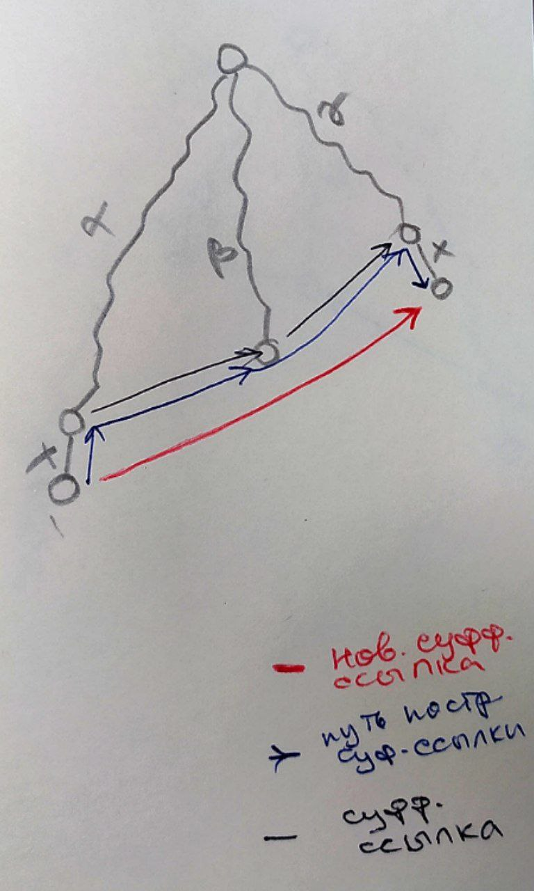

# Поиск строк. Ахо-Корасик
Это используется в grep вроде как

Можно написать фильтр матерных слов

Если в такой задаче использовать кмп, сложность будет O( n * |t| + SUMM(Si) ).

Мощность алфавита влияет на на разрастание дерева. По идее построение дольше, когда больше букв - как я понимаю, потому что дольше добавлять новую вершину, чем переходить.

Есть мнение, что КМП - АХО на бамбуке (длинная цепь), где в виде суфф.ссылок значения префиксной функции. Но мне немного сомнительно, потому что в КМП у нас префиксы нужны, а не суффиксы, как в Ахо.

Стоит запомнить, что тут по фамилиям двух авторов - А. Ахо и Маргарет Корасик.
## Задача точного поиска набора образцов
    t - текст
    S1, S2, .. Sn - n паттернов

## Trie
Бор - Trie - нагруженное дерево - структура данных для хранения набора строк, представляющая из себя подвешенное дерево с символами на рёбрах. Строки получаются последовательной записью всех символов, хранящихся на рёбрах между корнем бора и терминальной вершиной.
Размер бора линейно зависит от суммы длин всех строк, а поиск в бору занимает время, пропорциональное длине образца.

Обозначим за [u] слово, приводящее в вершину u в боре.

Узлы бора можно понимать как состояния автомата, а корень как начальное состояние.

Узлы бора, в которых заканчиваются строки, становятся терминальными.

## Задача о словаре
Задача о словаре также решается с помощью алгоритма Ахо-Корасик. В этом случае набор образцов представляет собой словарь, а текст проверяется на наличие слов из этого словаря. Примером
такой задачи может быть проверка текста на наличие запрещенных слов или поиск ключевых слов
в большом объеме данных.

## Алгоритм Ахо-Корасик

Алгоритм:
1. Построение бора
2. Построение суффиксных ссылок
3. Построение хороших суффиксных ссылок / терминальных ссылок
4. Проход по строке

    Рассмотрим, как автомат будет использоваться. По очереди просматриваются символы текста. Для очередного символа char совершается переход из текущего состояния v по символу char с помощью функции перехода. Оказавшись в новом состоянии, отмечаем по хорошим ссылкам строки, которые нам встретились и их позицию. Если новое состояние является терминалом, то соответствующие ему строки тоже отмечаем.

Есть несколько функций:
* parent(u) - родитель вершины
* pi(u) - суффиксная ссылка

    pi(u) = delta( pi(parent(u)) , c)

  Тут пример, когда пришлось подняться по суффиксной ссылке, не обнаружить c, поэтому по правилам delta переход по суффиксной ссылке (без поднятия к родителю) и снова поиск символа среди потомков (тут уже успешный).

  
* delta(u, c) - функция перехода из u по c

    delta(u, c) = v, если v - потомок по символу

    delta(u, c) = root, если u - корень и нет c в детях

    delta(u, c) = delta( pi(u) , c ) - иначе переход по ссылке и поиск там

**Суффиксная ссылка** - переход от данной вершины бора к вершине, путь которой является наибольшим суффиксом пути данной вершиины.

**Хорошая суффиксная/терминальная/конечная ссылка** - переход от данной вершины бора к терминальной вершине, путь которой является наибольшим суффиксом пути данной вершины, или к корню, если такой вершины нет.
По сути конечная ссылка ведет на наибольший суффикс, который является строкой в наборе.

**Построение бора занимает O(L)**, где L – _суммарная длина всех строк в наборе_.

**Построение суффиксных ссылок занимает линейное время O(L)**, так как каждая ссылка строится на основе ссылок предыдущих вершин и запоминается. 

Рассмотрим **поиск по строке**. Считаем, что ссылки построены, переход по автомату занимает константное время. Проход по строке занимает O(N), где N – длина строки. 
Но нужно проверить еще и конечные ссылки. Их не больше количества вхождений подстрок в строку, следовательно, это занимает O(c). 
Т.е. **O(N + c)**.

Итоговая сложность по операциям – **O(L+N+c)**.

Определим сложность по памяти. Если комбинации символов в строках набора полностью различаются, то для каждого символа понадобится одна вершина. В моей реализации для каждой вершины хранятся потомки и переходы. Максимальное число переходов и потомков размеру алфавита. Поэтому **сложность по памяти – O(Lk)??????**, где L – суммарная длина всех строк в наборе, k – размер алфавита. 
