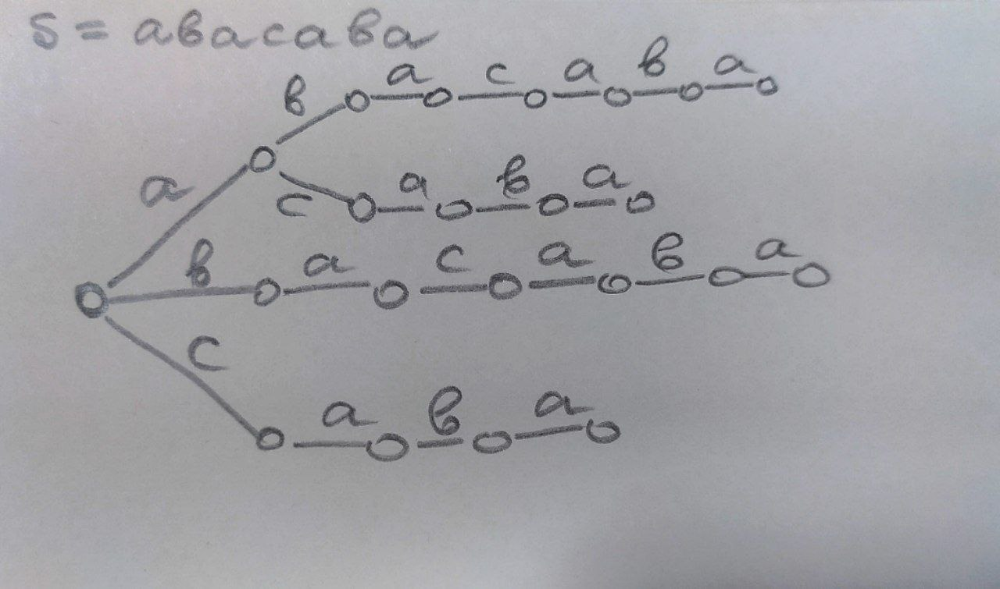

# Поиск строк. Суффиксные деревья и массивы
Это про задачу, когда известен текст, но неизвестны шаблоны. То есть есть предобработка ТЕКСТА. Видимо это и есть мОтиВаЦия.

    T - текст длины n
    P - неизвестный паттерн длины m

Это можно использовать в генетике. Там часто происходит сведение строковых задач к графам. Например, графы Де Брюина. Причем сведение происходит с помощью суффиксных массивов и суффиксных деревьев.

## Суффиксное дерево - мотивация, сложность, поиск
Суффиксное дерево - дерево всех возможных префиксов всех суффиксов.

Из root выходит k ребер, где k - количество различных символов.

Тут память O(n^2).

Суффиксное дерево (сжатое суффиксное дерево) T для строки s (где |s|=n) - дерево с n листьями, обладающее следующими свойствами:
* Каждая внутренняя вершина дерева имеет не меньше двух детей.
* Каждое ребро помечено непустой подстрокой строки s.
* Никакие два ребра, выходящие из одной вершины, не могут иметь пометок, начинающихся с одного и того же символа.

Со слов Калишенко сжатое суффиксное дерево можно считать оптимизацией суффиксного дерева. Мы просто сжимаем части бамбука.

// Это не совсем еще сжатое суффиксное дерево

Тут не более N листьев, сл. O(N) вершин.

Но тут не учитывается, что есть aba и abacaba. Суффикс aba является префиксом abacaba. Для решения этой проблемы в конце строки s добавляют защитный символ - он не входит в алфавит. Обозначим его $. Тогда получаем

АЛГОРИТМ ПОСТРОЕНИЯ МЫ НЕ ПРОШЛИ.

Поиск осуществляется за O(m), m - длина ПАТТЕРНА. Мы просто по дереву проходим в зависимости от символлов.

## Суффиксный массив - мотивация, сложность, поиск

Суффиксный массив - массив всех возможных суффиксов в _лексикографическом_ порядке.

Для нашего примера с abacaba получится

    a
    aba
    abacaba
    acaba
    ba
    bacaba
    caba

Поиск - просто бинарный. Поэтому сложность поиска O(|P| log|T|). 

#### ЩА БУДЕТ ИЗ ИНЕТА что-то более нормальное (я надеюсь), потому что он ничего не рассказал

Суффиксным массивом строки называется перестановка индексов начал её суффиксов, которая задаёт их порядок в порядке лексикографической сортировки. Иными словами, чтобы его построить, нужно выполнить сортировку всех суффиксов заданной строки.

В случае с суффиксным массивом можно сделать следующее: найти бинарным поиском первый суффикс в суффиксном массиве, который меньше искомого слова, а также последний, который меньше. Все суффиксы между этими двумя будут включать искомую строку как префикс.

Работать такой алгоритм будет за O(|p| * log|t|), и позже это можно будет оптимизировать до O(|t| + log|s|), что является одним из самых оптимальных алгоритмов поиска.

Сложность **O(|p| * log|t|)**, потому что бинарный поиск работает за log|t|, а сравнение с образцом не превышает |p|.

По сути хранить можно не сами суффиксы, а позиции начала суффикса. Тогда это даже по памяти будет O(|t|).

Сложности построения (МЫ НЕ ПРОХОДИЛИ):
1. тривиально (циклические сдвиги для поиска суффиксов и сортировка std::sort) - O(N^2 * logN)
2. можно за O(N * log^2(N)) - там что-то перестановка 
3. оптимально за O(N * logN)
4. линейное - Каркайнен и Сандерс
5. O(n) - алг Касаи

