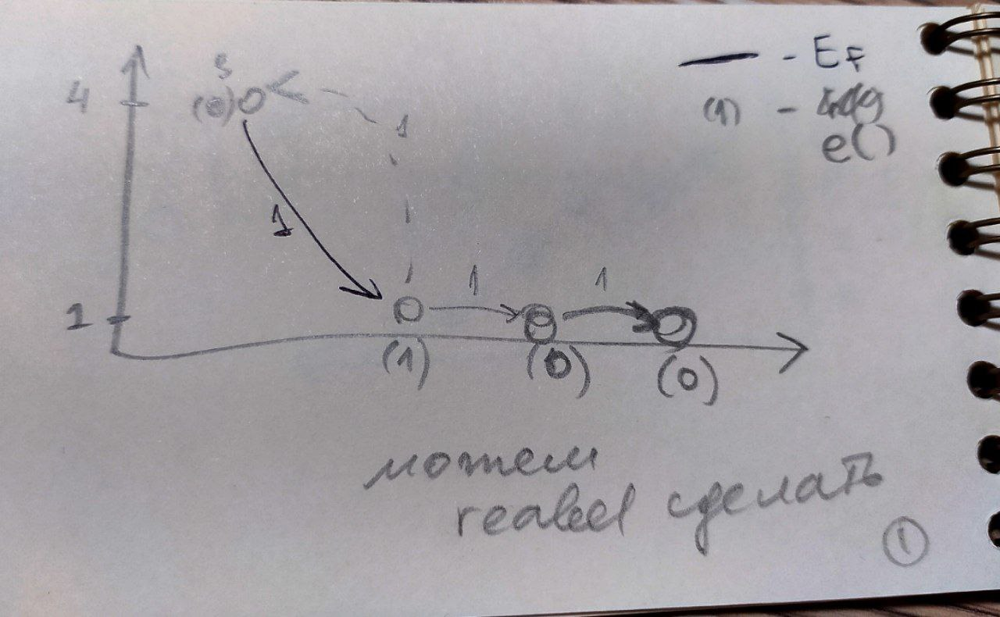
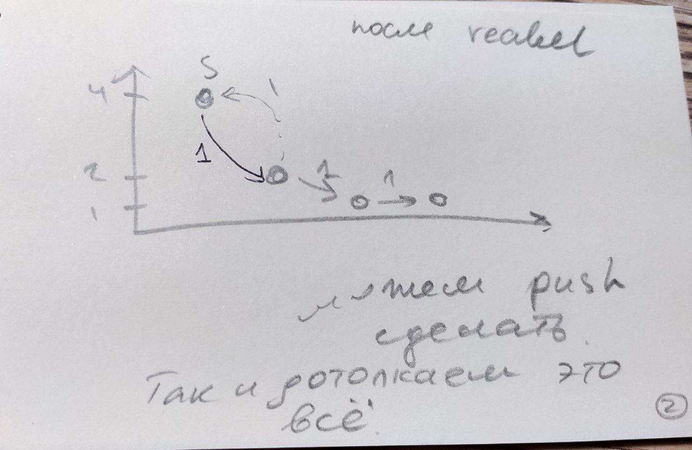

# Потоки в графах
Транспортная сеть - ориентированный граф, у которого есть исток (начало по сути) и сток (конец по сути).

Поток - функция

### Напоминание Форда-Фалкерсона

#### Идея поиска пути в остаточной сети и обратные рёбра

    G - граф
    f - flow - поток
    Cf - остаточная сеть. То, что еще можем использовать + обратные ребра

На первом шаге алгоритма остаточная сеть - сам граф.
На каждой итерации ищем любой дополняющий путь сети. К максимальному потоку графа добавляем вес минимального ребра пути.

Далее добавляются обратные ребра - искусственные. Они имеют вес пропускной способности, которую задействовали на этом ребре.

Обратные ребра добавляют шанс другой путь найти, через микро откат. 

Если на какой-то итерации мы идем по обратному пути, то мы меняем значения прямого и обратного ребра на задействованную величину.

Алгоритм заканчивается, когда мы не можем найти путь из истока в сток.

#### Сложность
O(E*|F|) - количество ребер на размер максимального потока.

Почему? Когда ищем путь, каждый раз проходим по всем ребрам (линейного поиска нам достаточно). Отсюда E. 
В худшем случае будем находить путь, который будет поток на 1 увеличивать. Отсюда будет максимум F поисков.

Поэтому могут быть случаи, когда ФФ будет работать долго, а на взгляд будет все сразу понятно.

### Алгоритм Гольдберга (проталкивания предпотока):

#### Идея push-relabel алгоритмов
Для понимания идеи алгоритма представим, что наша сеть — система из резервуаров, находящихся на определенной высоте, и соединяющих их труб с заданными пропускными способностями, соответствующих вершинам и рёбрам в исходной сети. Сам алгоритм можно представить как
процесс поочередного "переливания"жидкости (операция проталкивания) из одного резервуара в
другие, находящиеся на меньшей высоте, до тех пор пока не перестанет существовать резервуар,
соответствующий переполненной вершине. Может случиться ситуация, что все трубы, выходящие
из переполненной вершины 𝑢, ведут к вершинам, находящимся на такой же высоте что и 𝑢 или выше её. В таком случае поднимем резервуар (операция подъёма), соответствующий данной вершине,
таким образом, чтобы его высота стала на единицу больше, чем высота самого низкого из смежных
резервуаров. После подъёма будет существовать по крайней мере одна труба, по которой можно
пропустить жидкость.

В итоге, у нас не останется ни одной переполненной вершины, та часть потока, которая могла
пройти к стоку, окажется там, остальная же вернется в исток. В такой ситуации предпоток превращается в обычный поток, так как для каждой вершины выполняется условие сохранения потока.
Как будет показано далее, предпоток становится не только обычным, но и максимальным потоком

#### Формализмы и инварианты
G - граф

f: VxV -> R - предпоток
* кососимметричная (сколько пропустили по ребру, столько можно в обратную сторону пропустить)
* f(u, v) <= c(u, v) - ограничение пропускной способности // c - capacity - вес, как я понимаю
* для u из V\{s, t} SUMM по v из V (f(v, u)) >= 0 - ослабленное условие сохранения потока

e(u) - ?ercess? - избыточный поток
* e(u) = SUMM по v из V ( f(v, u))

Если для u из V\{s,t} e(u) > 0, то вершина переполнена.

Здесь мы разрешаем, что втекать в вершину может >= чем вытекать. Будем уменьшать излишки максимально

h(v) - высотная функция
* h(s) = |V|
* h(t) = 0
* h(u) <= h(v) + 1 // есть ребро u->v. они на разных уровнях

Между слоями разница не более чем в 1.

С более низкого на более высокий можно. То есть при u->v, либо на 1 уровень ниже, либо такая же высота, либо куда-то наверх может.

Чтобы избежать ситуации, когда у нас при развешивании появляется переход больше 1, мы при начальной инициализации алгоритма не только развешиваем вершины, но и 
заранее попускаем из старта во все следующие максимальный поток, который можем пропустить. То есть возникнет ребро обратное. Алгоритм дальше будем с учетом всего это запускать - как я поняла, по остаточной сети.

f(u, v) =
* = c(u, v) , v?=s
* = -f(v, u), u=s
* 0, else

Есть две операции:
* push - проталкивание потока
* relabel - изменение высот

Они сохраняют инварианты, хоть и перевзвешивают ребра. Если нельзя ни одну из них применить, то получим максимальный поток.
В результате операций избыток будет только в старте. Остальное протолкнется.

Всегда верно то, что никогда не будет пути из истока в сток (дополняющего), потому что иначе мы бы нарушили инвариант разности высот. 
Когда мы будем искать путь из старта до финиша в остаточной сети. В худшем случае длина этого пути равна |V|-1. А по высоте разница |V|. То есть чисто физически не может быть такого пути. 

Суть push:
* u переполнена
* Остаточная пропускная способность еще существует. Cf(u, v) > 0
* h(u) = h(v) + 1
* Если все выше выполнено, то проталкиваем:

    Df(u, v) = min( Cf(u, v) ; e(u) ) - разница, то что можем протолкнуть

    f(u, v) += Df(u, v) - новый предпоток. добавили то, что протолкнули

    f(v, u) = - f(u, v) - обратное ребро строим
    
    e(u) -= Df(u, v) - мы от избытка избавились переливанием

    e(v) += Df(u, v) - добавили сюда еще. надо избыток увеличить

Суть relabel:
* u переполнена
* Ребро (любое исходящее) uv принадлежит Ef (предпотоку текущему??)
* h(u) <= h(v)
* Тогда поднимаем высоту вершины

    h(u) = 1 + min( h(v) | (uv) принадлежат Ef )

В конце может получиться, что какие-то вершины выше стартовой. Это когда слишком много надо вернуть в стартовую.
 Чтобы пушить в источник, мы должны быть выше источника. 
    

#### Доказательство корректности
Доказательство корректности алгоритма проталкивания предпотока (Push-Relabel) включает несколько ключевых шагов. Вот общий обзор доказательства корректности этого алгоритма:
1. Лемма о высоте: Доказывается, что высота вершин в остаточной сети удовлетворяет условию леммы о высоте. Это означает, что высота вершины является допустимой и соответствует
количеству ребер от источника до данной вершины в остаточной сети.
2. Лемма о насыщенных вершинах: Доказывается, что все вершины, кроме источника и
стока, либо насыщены (то есть имеют положительный предпоток, превышающий исходящий
поток), либо являются просачивающимися (то есть имеют положительный предпоток, равный
исходящему потоку). Эта лемма гарантирует, что не будет "застревания"предпотока в вершинах.
3. Лемма о промежуточном потоке: Доказывается, что в любой момент времени все вершины, кроме источника и стока, имеют промежуточный поток, который является допустимым
потоком в остаточной сети.
4. Теорема о корректности: На основе лемм, описанных выше, доказывается, что алгоритм
проталкивания предпотока находит максимальный поток в сети. Это означает, что алгоритм
правильно находит оптимальное значение максимального потока между источником и стоком

#### Сравнение сложности с Фордом-Фалкерсоном
Она зависит только от V E. Не зависит от F. 

ФФ менее эффективен.

Тут в худшем O(V^3). Можно квадрат или даже логарифм. Зависит от реализации.

Умное из конспекта!!!!

Идея алгоритма Форда-Фалкерсона заключается в следующем. Изначально величине потока присваивается значение 0: 𝑓(𝑢,𝑣) = 0 для всех 𝑢,𝑣 из 𝑉 . Затем величина потока итеративно увеличивается посредством поиска увеличивающего пути (путь от источника 𝑠 к стоку 𝑡, вдоль которого можно 
послать ненулевой поток). Обычно этот поиск осуществляется с помощью обхода в глубину (DFS).
Процесс повторяется, пока можно найти увеличивающий путь.

Сложность алгоритма Форда-Фалкерсона − O(|E| * F), где F - максимальный поток в графе.

Сложность push-relable − O(|V|^2 * |E|)

Сложность push-relable с оптимизациями − O(|V|^3)
