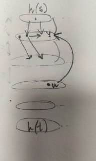

# Потоки в графах
Транспортная сеть - ориентированный граф, у которого есть исток (начало по сути) и сток (конец по сути).

Поток - функция

### Напоминание Форда-Фалкерсона

#### Идея поиска пути в остаточной сети и обратные рёбра

    G - граф
    f - flow - поток
    Cf - остаточная сеть. То, что еще можем использовать + обратные ребра

На первом шаге алгоритма остаточная сеть - сам граф.
На каждой итерации ищем любой дополняющий путь сети. К максимальному потоку графа добавляем вес минимального ребра пути.

Далее добавляются обратные ребра - искусственные. Они имеют вес пропускной способности, которую задействовали на этом ребре.

Обратные ребра добавляют шанс другой путь найти, через микро откат. 

Если на какой-то итерации мы идем по обратному пути, то мы меняем значения прямого и обратного ребра на задействованную величину.

Алгоритм заканчивается, когда мы не можем найти путь из истока в сток.

#### Сложность
O(E*|F|) - количество ребер на размер максимального потока.

Почему? Когда ищем путь, каждый раз проходим по всем ребрам (линейного поиска нам достаточно). Отсюда E. 
В худшем случае будем находить путь, который будет поток на 1 увеличивать. Отсюда будет максимум F поисков.

Поэтому могут быть случаи, когда ФФ будет работать долго, а на взгляд будет все сразу понятно.

### Алгоритм Гольдберга (проталкивания предпотока):

#### Идея push-relabel алгоритмов

#### Формализмы и инварианты
G - граф

f: VxV -> R - предпоток
* кососимметричная (сколько пропустиои по ребру, столько можно в обратную сторону пропустить)
* f(u, v) <= c(u, v) - ограничение пропускной способности // c - capacity - вес, как я понимаю
* для u из V\{s, t} SUMM по v из V (f(v, u)) >= 0 - ослабленное условие сохранения потока

e(u) - ?ercess? - избыточный поток
* e(u) = SUMM по v из V ( f(v, u))

Если для u из V\{s,t} e(u) > 0, то вершина переполнена.

Здесь мы разрешаем, что втекать в вершину может >= чем вытекать. Будем уменьшать излишки максимально

h(v) - высотная функция
* h(s) = |V|
* h(t) = 0
* h(u) <= h(v) + 1 // есть ребро u->v. они на разных уровнях

Между слоями разница не более чем в 1.

С более низкого на более высокий можно. То есть при u->v, либо на 1 уровень ниже, либо такая же высота.

#### Доказательство корректности

#### Сравнение сложности с Фордом-Фалкерсоном

